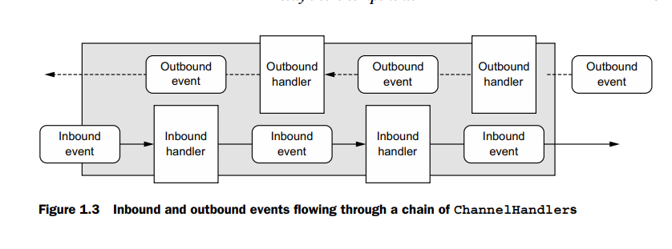

# Introduction

This repository will audit my learnings of Netty. My referece to learn Netty is the [Netty In Action](https://www.manning.com/books/netty-in-action) book. I will simply summarize my learnings in each chapter along with some example

## Part 1  -> Netty Concepts and Architechture

Before we start with actual netty implementations, we will discuss the philosophy of netty. 

### Networking in Java

Earlier networking in java meant dealing directlly with the C socket libraries. Look up the example at [BeforeNettyExample](/BeforeNettyExample) to understand what I mean.

You would notice that to create that example, we have to create one thread for each socket. Now, creating a thread for every connection is expensive as the memory needs to be allocated on the stack. A program like this will not scale.

So what are the alternatives?

* Java NIO *

This provides us methods for non blocking input output operations.

* Selectors *

The architechture looks like this

<pre>
Socket -> Read/Write --
			\
Socket -> Read/Write	---> Selectors -> Thread
			/
Socket -> Read/Write--

Using the event notification API, selectors understand which _non blocking_ socket is ready for IO
</pre>

### Netty core concepts

1. Channels
2. Callbacks
3. Futures
4. Events and handlers

* Channels *

An open connection to an entity such as a hardware device, a file, a
network socket, or a program component that is capable of performing
one or more distinct I/O operations, for example reading or writing

* Callback *

Bit to fundamentals. Skipping the description

* Futures *

An async operation which will complete sometime in future and then only return the result. Netty has its own implementation of `Future` called `ChannelFuture.`. We can register a `ChannelFutureListener` whose methods will be called when the future has finished. This will be called regardless of whether the future was able to achieve its gold or not. A throwable will be sent if it failed.

All of Netty's outbound operation return a ChannelFuture

*Events and handlers* 

Events that may be triggered by inbound data or an associated change of state include

1. Active or inactive connections

2. Data reads

3. User events

4. Error events

An outbound event is the result of an operation that will trigger an action in the future, which may be

1. Opening or closing a connection to a remote peer
2. Writing or flushing data to a socket

